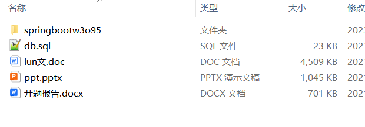

# springboot_club_mural_hospital_gym_rental
### **项目介绍**

🎭 **俱乐部管理系统** —— 会员管理、活动组织、在线预约，助力俱乐部高效运营 📅🏆

🖼️ **墙绘产品展示交易系统** —— 作品展示、在线交易、订单管理，推动墙绘艺术商业化 🎨🛒

🏥 **社区医院信息平台** —— 患者管理、预约挂号、医生排班，提升社区医疗服务智能化水平 🏥💉

🏟️ **体育馆管理系统** —— 场馆预订、会员管理、活动安排，优化体育场馆的运营和使用效率 🏋️‍♂️📅

🔄 **网上租赁系统** —— 商品租赁、租期管理、押金支付，打造完整的线上租赁业务流程 🛒💰

本仓库采用 **SpringBoot** 作为核心后端，结合 **Spring Security、Redis、MySQL、MyBatis Plus、Vue.js** 等技术，提供高效、稳定的企业级 Web 应用解决方案。欢迎 **Star ⭐、Fork 🍴**，一起学习进步！ 🚀💡

项目部署说明✨：

推荐使用：谷歌浏览器

后台地址😎
http://localhost:8080/springboot/admin/dist/index.html

管理员  abo 密码 abo

前台地址😎

http://localhost:8080/springboot/front/index.html

在src\main\resources\application.yml中编辑数据库配置🎉										
url: jdbc:mysql://127.0.0.1:3306/springboot?useUnicode=true&characterEncoding=utf-8&useJDBCCompliantTimezoneShift=true&useLegacyDatetimeCode=false&serverTimezone=UTC
username: root
password: 123456

文档预览👀

其他项目合集✨

